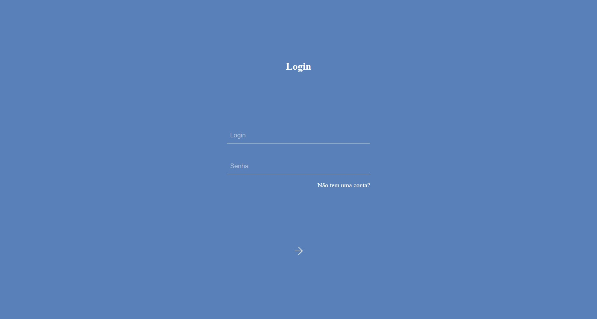

<h1 align="center"> Tela Login </h1>

Projeto de cadastro e login de usuários com django e sqlite 

  <a href="#-tecnologias">Tecnologias</a>

 

  

## 🎓 Tecnologias

Esse projeto foi desenvolvido com as seguintes tecnologias:

- HTML e CSS
- Django e Python
- Git e Github
- Sqlite
- Figma

---

<h4 align="center">By: Isaluh 🤍</h4>